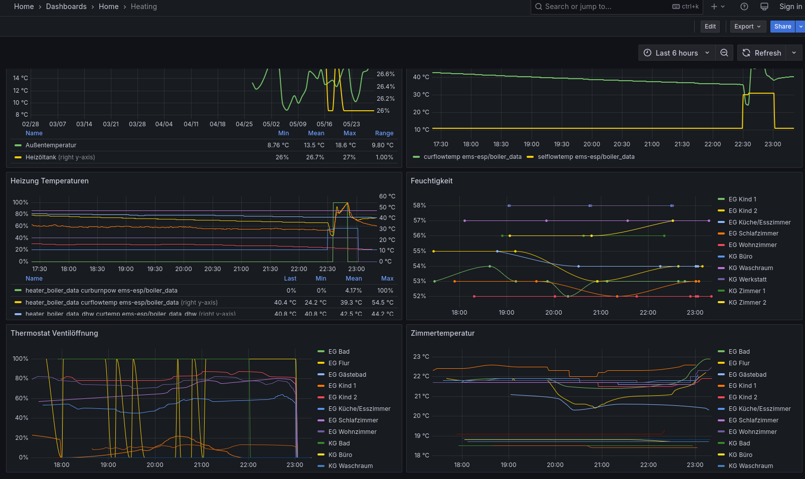
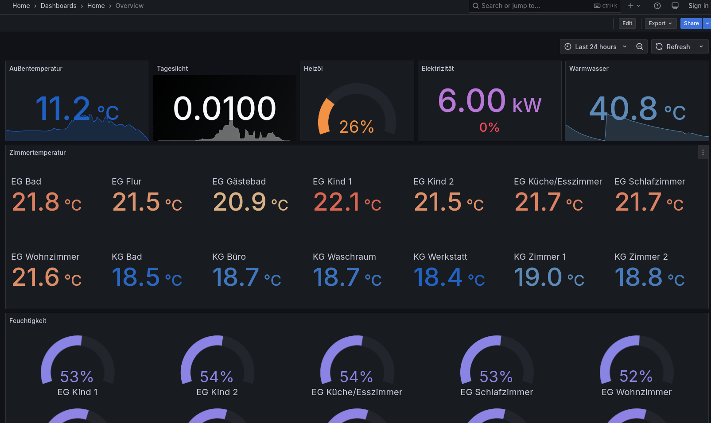
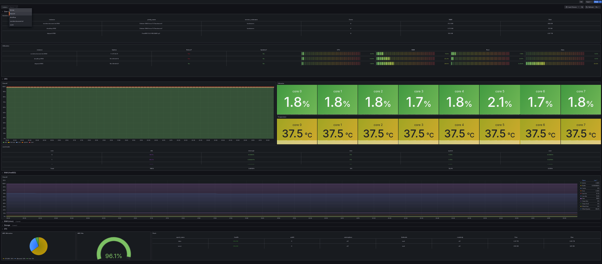
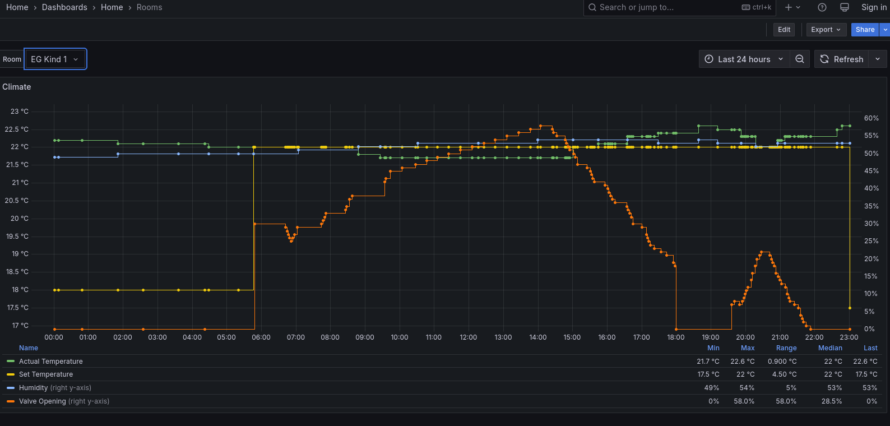
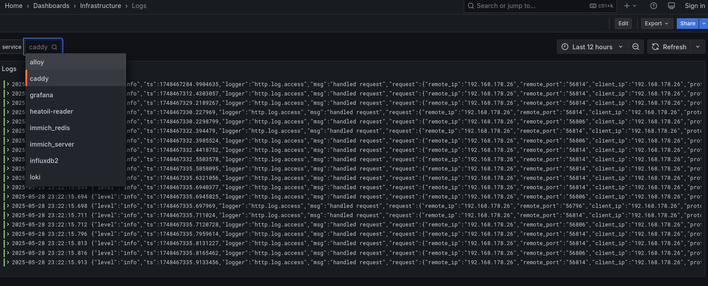

# homelab

a homelab setup

## Some impressions

Highlights:
 - per room climate monitoring
 - outside climate
 - heating system details - helps with optimizing costs
 - home lab infrastructure and services logs

Because in this case some pictures really tell more than words:

<table>
  <tr>
    <td></td>
    <td></td>
  </tr>
  <tr>
    <td></td>
    <td></td>
  </tr>
  <tr>
    <td colspan="2"></td>
  </tr>
</table>
