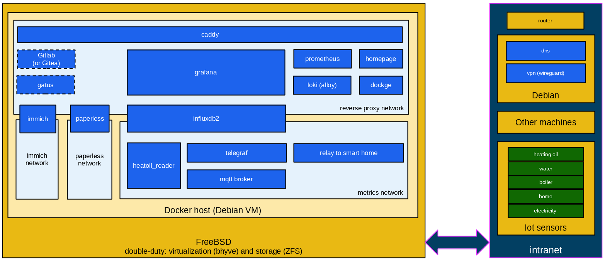

# Homelab

A Homelab setup with the following highlights:
 - per room climate monitoring
 - outside climate
 - heating, electricity (and water soon) consumption
 - image and documents hosting and backups
 - home lab infrastructure and services logs

## Some impressions

Because in this case some pictures (click for larger version) really do tell more than words:

<table>
  <tr>
    <td></td>
    <td></td>
  </tr>
  <tr>
    <td></td>
    <td></td>
  </tr>
  <tr>
    <td colspan="2"></td>
  </tr>
</table>

## High level architecture

Depiction of the high level building blocks making up the homelab setup. To keep it
concise some details have been ommitted.

 * deployment is done with [pyinfra](https://pyinfra.com/)
 * setup is based on [Go](https://docs.docker.com/compose/)
 * custom programmings in [Go](https://go.dev/) (and some Shell)

